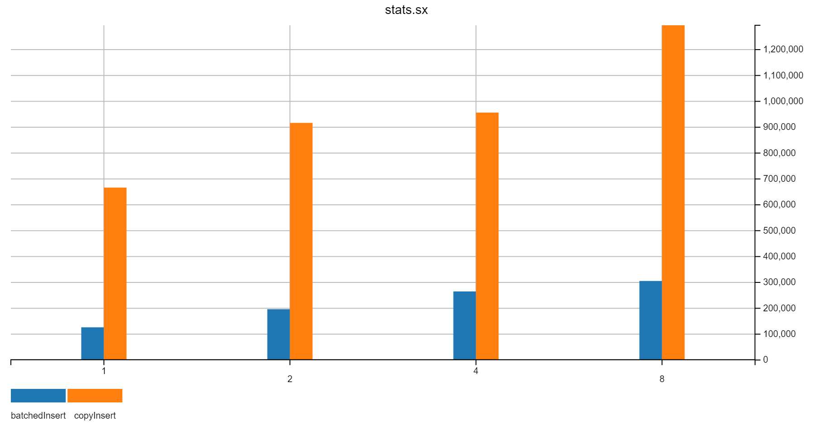

local pg



```
-- 1 thread -------------------------------------

= batchedInsert;  numRows = 22000000; batchSize = 100000 =
total	174862ms	100.0%
setObject	3488ms	2.0%
addBatch	2383ms	1.4%
executeBatch	167819ms	96.0%
commit	12ms	0.0%
126436.8 rows/sec

= copyInsert;  numRows = 22000000; batchSize = 100000 =
total	33713ms	100.0%
export	1510ms	4.5%
writeToCopy	345ms	1.0%
endCopy	31745ms	94.2%
commit	45ms	0.1%
666666.7 rows/sec

------------ 2 threads ------------------------------------

= batchedInsert;  numRows = 22000000; batchSize = 100000 	total time = 112531ms	196428.6 rows/sec =
total	112323ms	100.0%
setObject	1841ms	1.6%
addBatch	1147ms	1.0%
executeBatch	108697ms	96.8%
commit	20ms	0.0%
11000000 rows, 98214.3 rows/sec
------
total	112491ms	100.0%
setObject	1804ms	1.6%
addBatch	1130ms	1.0%
executeBatch	108925ms	96.8%
commit	5ms	0.0%
11000000 rows, 98214.3 rows/sec

= copyInsert;  numRows = 22000000; batchSize = 100000 	total time = 24565ms	916666.7 rows/sec =
total	24514ms	100.0%
export	850ms	3.5%
writeToCopy	207ms	0.8%
endCopy	23411ms	95.5%
commit	6ms	0.0%
11000000 rows, 458333.3 rows/sec
------
total	24528ms	100.0%
export	834ms	3.4%
writeToCopy	199ms	0.8%
endCopy	23436ms	95.5%
commit	12ms	0.1%
11000000 rows, 458333.3 rows/sec

------------ 4 threads ------------------------------------
    
= batchedInsert;  numRows = 22000000; batchSize = 100000 	total time = 83259ms	265060.2 rows/sec =
total	82053ms	100.0%
setObject	1053ms	1.3%
addBatch	659ms	0.8%
executeBatch	80012ms	97.5%
commit	10ms	0.0%
5500000 rows, 67073.2 rows/sec
------
total	82852ms	100.0%
setObject	989ms	1.2%
addBatch	627ms	0.8%
executeBatch	80907ms	97.7%
commit	9ms	0.0%
5500000 rows, 67073.2 rows/sec
------
total	82896ms	100.0%
setObject	1022ms	1.2%
addBatch	664ms	0.8%
executeBatch	80891ms	97.6%
commit	4ms	0.0%
5500000 rows, 67073.2 rows/sec
------
total	83211ms	100.0%
setObject	984ms	1.2%
addBatch	627ms	0.8%
executeBatch	81272ms	97.7%
commit	13ms	0.0%
5500000 rows, 66265.1 rows/sec

= copyInsert;  numRows = 22000000; batchSize = 100000 	total time = 23864ms	956521.7 rows/sec =
total	23796ms	100.0%
export	488ms	2.1%
writeToCopy	113ms	0.5%
endCopy	23143ms	97.3%
commit	11ms	0.0%
5500000 rows, 239130.4 rows/sec
------
total	23815ms	100.0%
export	490ms	2.1%
writeToCopy	115ms	0.5%
endCopy	23167ms	97.3%
commit	5ms	0.0%
5500000 rows, 239130.4 rows/sec
------
total	23802ms	100.0%
export	475ms	2.0%
writeToCopy	112ms	0.5%
endCopy	23174ms	97.4%
commit	5ms	0.0%
5500000 rows, 239130.4 rows/sec
------
total	23812ms	100.0%
export	471ms	2.0%
writeToCopy	116ms	0.5%
endCopy	23187ms	97.4%
commit	0ms	0.0%
5500000 rows, 239130.4 rows/sec

------------ 8 threads ------------------------------------
= batchedInsert;  numRows = 22000000; batchSize = 100000 	total time = 72288ms	305555.6 rows/sec =
total	71616ms	100.0%
setObject	772ms	1.1%
addBatch	518ms	0.7%
executeBatch	70117ms	97.9%
commit	37ms	0.1%
2750000 rows, 38732.4 rows/sec
------
total	71625ms	100.0%
setObject	712ms	1.0%
addBatch	532ms	0.7%
executeBatch	70203ms	98.0%
commit	5ms	0.0%
2750000 rows, 38732.4 rows/sec
------
total	71717ms	100.0%
setObject	656ms	0.9%
addBatch	581ms	0.8%
executeBatch	70284ms	98.0%
commit	23ms	0.0%
2750000 rows, 38732.4 rows/sec
------
total	71891ms	100.0%
setObject	646ms	0.9%
addBatch	441ms	0.6%
executeBatch	70590ms	98.2%
commit	5ms	0.0%
2750000 rows, 38732.4 rows/sec
------
total	72014ms	100.0%
setObject	721ms	1.0%
addBatch	557ms	0.8%
executeBatch	70563ms	98.0%
commit	4ms	0.0%
2750000 rows, 38194.4 rows/sec
------
total	72014ms	100.0%
setObject	644ms	0.9%
addBatch	759ms	1.1%
executeBatch	70434ms	97.8%
commit	3ms	0.0%
2750000 rows, 38194.4 rows/sec
------
total	72128ms	100.0%
setObject	730ms	1.0%
addBatch	628ms	0.9%
executeBatch	70593ms	97.9%
commit	2ms	0.0%
2750000 rows, 38194.4 rows/sec
------
total	72216ms	100.0%
setObject	644ms	0.9%
addBatch	520ms	0.7%
executeBatch	70858ms	98.1%
commit	23ms	0.0%
2750000 rows, 38194.4 rows/sec

= copyInsert;  numRows = 22000000; batchSize = 100000 	total time = 17883ms	1294117.6 rows/sec =
total	17143ms	100.0%
export	266ms	1.6%
writeToCopy	56ms	0.3%
endCopy	16663ms	97.2%
commit	116ms	0.7%
2750000 rows, 161764.7 rows/sec
------
total	17244ms	100.0%
export	248ms	1.4%
writeToCopy	58ms	0.3%
endCopy	16879ms	97.9%
commit	26ms	0.2%
2750000 rows, 161764.7 rows/sec
------
total	17532ms	100.0%
export	231ms	1.3%
writeToCopy	57ms	0.3%
endCopy	17190ms	98.1%
commit	23ms	0.1%
2750000 rows, 161764.7 rows/sec
------
total	17619ms	100.0%
export	238ms	1.4%
writeToCopy	56ms	0.3%
endCopy	17286ms	98.1%
commit	7ms	0.0%
2750000 rows, 161764.7 rows/sec
------
total	17713ms	100.0%
export	243ms	1.4%
writeToCopy	53ms	0.3%
endCopy	17377ms	98.1%
commit	7ms	0.0%
2750000 rows, 161764.7 rows/sec
------
total	17747ms	100.0%
export	261ms	1.5%
writeToCopy	54ms	0.3%
endCopy	17395ms	98.0%
commit	3ms	0.0%
2750000 rows, 161764.7 rows/sec
------
total	17794ms	100.0%
export	281ms	1.6%
writeToCopy	55ms	0.3%
endCopy	17418ms	97.9%
commit	6ms	0.0%
2750000 rows, 161764.7 rows/sec
------
total	17726ms	100.0%
export	238ms	1.3%
writeToCopy	53ms	0.3%
endCopy	17399ms	98.2%
commit	5ms	0.0%
2750000 rows, 161764.7 rows/sec
```